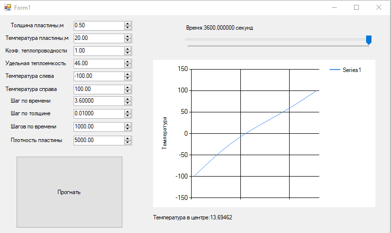

### Метод конечных разностей для уравнения теплопроводности

**Задание:**  
Реализовать моделирование изменения температуры в пластине на основе одномерного уравнения теплопроводности с использованием метода конечных разностей.

Выполнить моделирование с различными шагами по времени и по пространству.  
Заполнить таблицу значений температуры в центральной точке пластины после **3600** секунд модельного времени.

**Скриншот работы программы, параметры.**

| Шаг по времени, с \ Шаг по пространству, м| 0.25 | 0.1  | 0.05  | 0.01   |
|-------------------------------------------|----- |------|-------|--------|
| 360  |12.26|28.56|13.81|13.87|
| 36   |12.13|29.01|13.65|13.71|
| 3.6  |12.12|29.08|13.63|13.69|
| 1    |12.12|29.09|13.62|13.69|

**Вывод.**
Шаг по пространству влияет на точность результатов намного сильнее, когда как для точного результата достаточно шага 1/100 от нужного времени.
