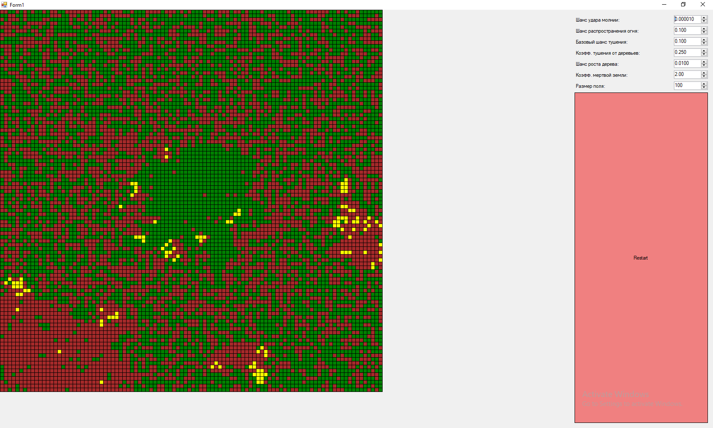

### Клеточные автоматы. Лесные пожары (GUI)

**Задание:**  
Реализовать моделирование возникновения и распространения лесных пожаров с использованием двумерного клеточного автомата.

**Правила симуляции:**
Есть три состояния - пустое, огонь и дерево.

**Скриншот программы**

**Параметры:**
Шанс удара молнии
Базовый шанс распространения огня.
Базовый шанс тушения.
Коэфф. тушения от ближайших деревьев.
Шанс роста дерева.
Коэфф. мертвой земли.
Размер поля.

**Дерево**
- Каждый тик может загореться если рядом есть горящие соседи. Чем их больше, тем сильнее увеличивается шанс загореться
- Шанс загореться = `Базовый шанс распространения огня * (количество горящих соседей)* позиционный коэффициент + Шанс удара молнии`
- Позиционный коэффициент = ((x - size/2)² + (y - size/2)²) / size² * 4  (Условно, в центре больше влажности, или температура меньше и т.п.)

**Огонь**
- Каждый тик может потухнуть и перейти в состояние пустоты
- Шанс потухнуть = `Базовый шанс тушения / (1 + соседние деревья * Коэфф. тушения от ближайших деревьев)²`
- Если потух → становится Пустотой, счетчик смертей клетки +1

**Пустота**
- Каждый тик может перейти в состояние дерева
- Шанс вырастить дерево = `Шанс роста дерева / (Коэфф. мертвой земли^(количество смертей + 1))`
- Чем больше раз горела клетка, тем хуже растет

**3 Спец. правила**
- Дерево горит с вероятностью зависящей от количества соседнего огня.
- Шанс загореться деревьям тем меньше, чем ближе они к центру.
- Огонь тухнет с меньшей вероятностью, если вокруг много деревьев
